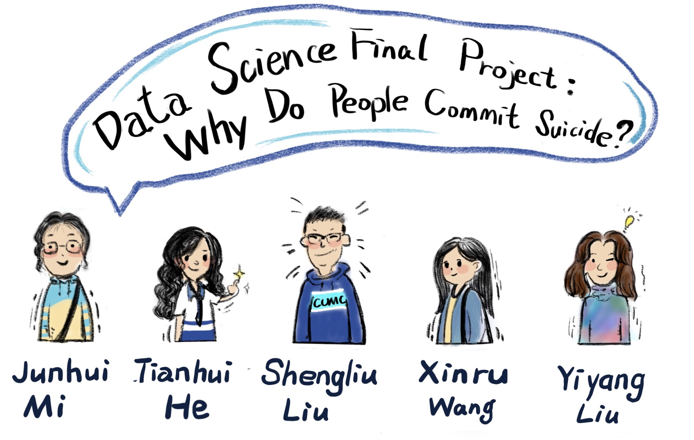

Junhui Mi, Tianhui He, Shenglin Liu, Xinru Wang, Yiyang Liu 

{width=600px}

 
<ul>
<li>Suicides and suicide attempts have a ripple effect that impacts on families, friends, colleagues, communities and societies. </li>
<li>Suicides are PREVENTABLE. Much can be done to prevent suicide at individual, community and national levels.</li>
</ul>

 

<h3>**Motivation**</h3>

Suicide has been of increasing concern all over the world. Nowadays, close to 800,000 people die by suicide every year. Furthermore, for each suicide, there are more than 20 suicide attempts. Suicides is the leading cause of death among teenagers and young adults death.

Our objective is to develop an online resource to plot and analyze global suiside rate and build models to explore the causes of suicide. The target audience for this webpage is all who is interesed in the causes of suicide and want to prevent himself/herself or people around from suicide. The goal of this resource is to raise awareness on the widespread impact of suicides, and inform public that suicides are preventable.

 

<h3>**Methods**</h3>

Using Flexdashboard to create maps and plots of global suicide rate from 1979 to 2016, and separate analysis of suicide rate across year, gender and age.

Using regression models and correlation analysis to explore the association between suicides and gdp, happiness and other covirates.

Using our analysis results and other website links to help people know more about suicides and prevent suicides.

 

<h3>**Data**</h3>

<h5>**WHO Suicide Statistics**</h5>
<ul>
<li>Basic historical (1979-2016) data by country, year and demographic groups.</li>

<li>6 variables in total, focused on plotting and analyzing global suiside rate.</li>

<li>Can be found [here](https://www.kaggle.com/szamil/who-suicide-statistics)</li>
</ul>
<h5>**World Happiness Report**</h5>
<ul>
<li>Happiness scored from 2015 to 2017 according to economic production, social support, etc.</li>

<li>12 variables in total, focused on model building to explore the causes of suicide.</li>

<li>Can be found [here](https://www.kaggle.com/unsdsn/world-happiness)</li>
</ul>

 
<h3>**Screencast**</h3>

<iframe width="560" height="315" src="https://www.youtube.com/watch?v=JPhAuJm1A1E&feature=youtu.be" frameborder="0" allow="accelerometer; autoplay; encrypted-media; gyroscope; picture-in-picture" allowfullscreen></iframe>

