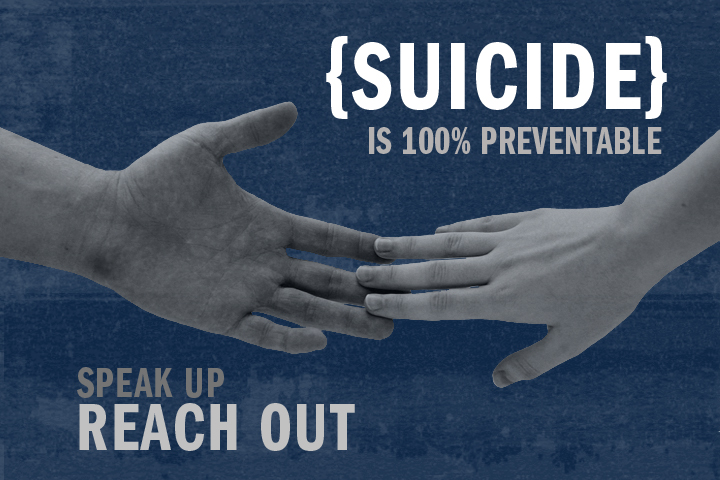

Suicides and suicide attempts have a ripple effect that impacts on families, friends, colleagues, communities and societies.

Suicides are preventable. Much can be done to prevent suicide at individual, community and national levels. 